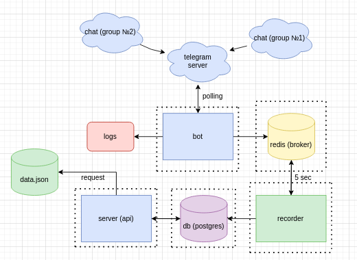

### **General information**

A bot for monitoring community activity in Telegram channels.\
One of the projects currently being monitored is [here](https://t.me/mizar_ai).

### ******The purpose of creating a bot****** 

To track activity/participation in Telegram, based on the data received, participants will be rewarded for activity on the client platform.\
The data will be obtained using our tool (bot).\
The bot will constantly track activity in the Telegram channel.

### **Communities must be**

* Monitoring, including messages sent
* Quality of messages
* Days of activity in the channel

### **Bot requirements**

The bot will record the collected data in a data.json file, which will be stored on the server.\
Bot will be configured through a web interface or API.\
The process needs to be automated so that the data is collected on the client platform automatically.   

### **Used libs** 
* psycopg2-binary
* aiogram
* redis
* django

**Project architecture**

